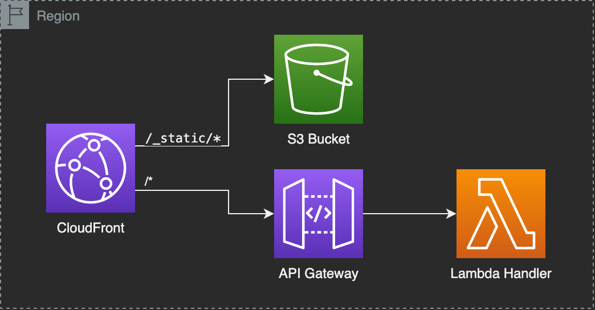

# 💽 remix-aws-cdk-example

This example is based on the `remix-run/architect` template and uses the `arc sandbox` for local development.
The deployment is done with the `aws-cdk v2`.

## Architecture



## 🧰 Setup

This repository uses [yarn workspaces](https://classic.yarnpkg.com/lang/en/docs/workspaces/).
To set up all use the following command:

```shell
yarn install
```

## ⌨️ Local Development

```shell
yarn start
```

Open up [http://localhost:3333](http://localhost:3333) and you should be ready to go!

## 🚀 AWS Deployment

If you want to have a look at the synthesized CloudFormation template, you can run `yarn synth` and find the template in `infrastructure/RemixStack.yml`.

You can deploy remix via the following commands:

```shell
yarn build
yarn deploy
```

## 🗑 Clean Up

Delete the CloudFormation stack named "RemixStack" created by this project.

## 🔗 Related Links

- [Remix Docs](https://remix.run/docs)
- [aws-cdk GitHub](https://github.com/aws/aws-cdk)
- [aws-cdk API Reference](https://docs.aws.amazon.com/cdk/api/v2/docs/aws-construct-library.html)
